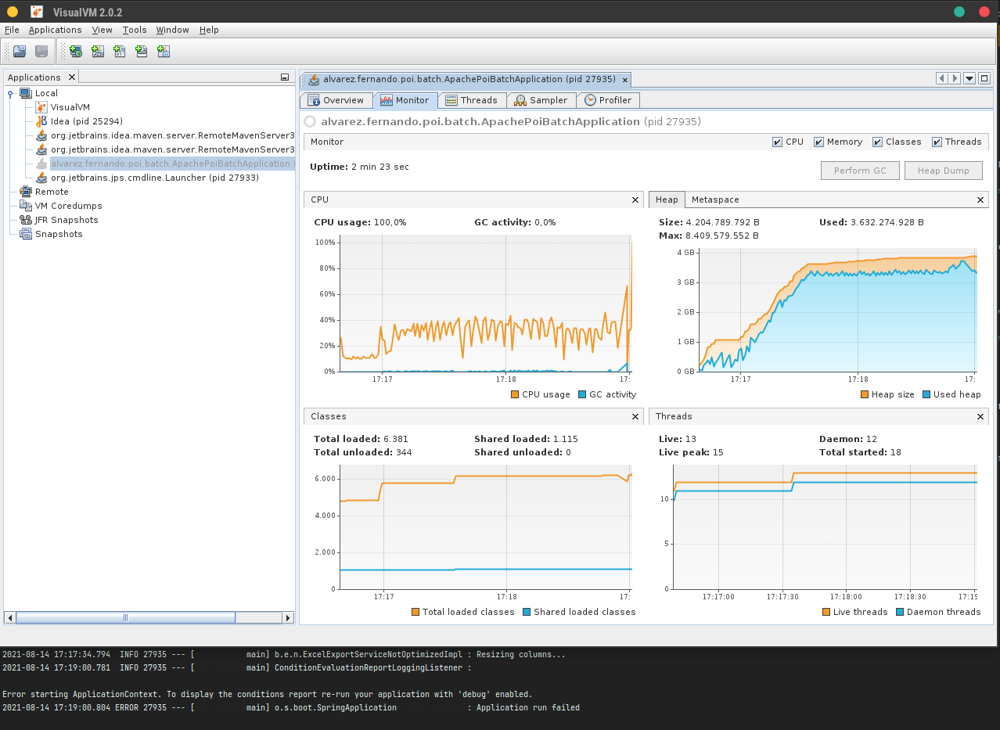
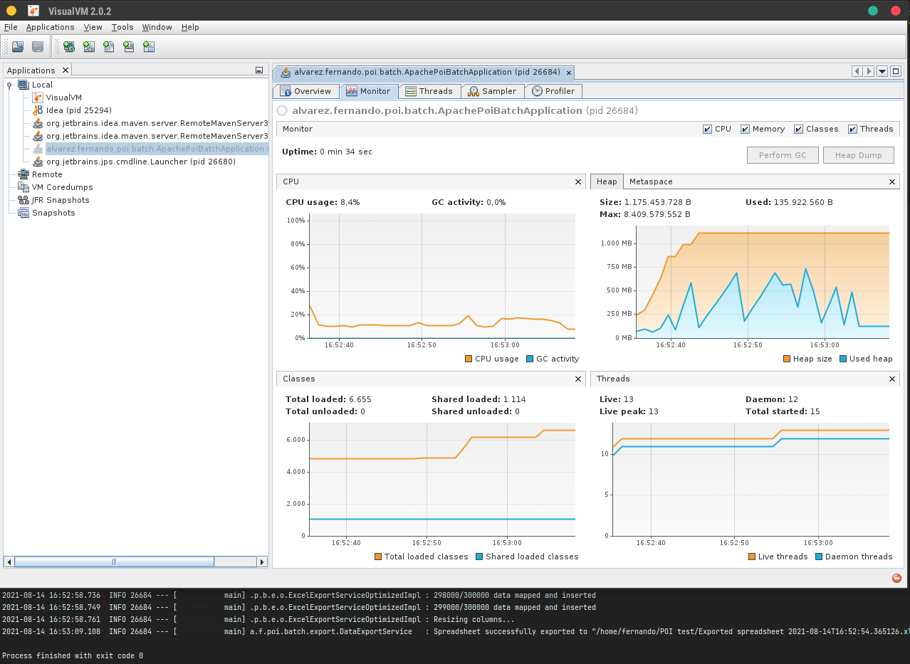
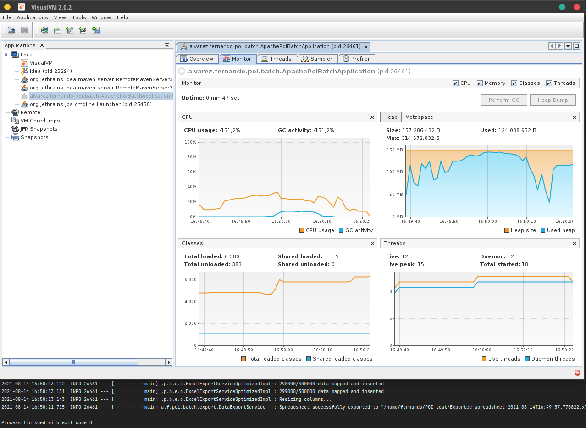

# apache-poi-batch
## Experiment to explore ways to export large amounts of data with Apache POI.

Where I work we had some memory problems with exporting spreadsheets with [Apache POI](https://poi.apache.org). Talking about solutions, we thought on creating a Proof of Concept with a more optimized solution, like closing and reopening the spreadsheet at every X rows somehow.

With this goal in mind, I created this project to generate a large amount of random fake data and export it with the implementation we have been using at work and with another more optimized implementation, after some research. Fortunately, this was easier than I thought.

### Data generation
My focus here is exporting spreadsheets, so there is not database or API consumption. I used [Java Faker](https://github.com/DiUS/java-faker) library to generate data.

By default the application will generate 300000 random "[Data](./src/main/java/alvarez/fernando/poi/batch/data/Data.java)" objects, but you can use another amount by passing a `data.quantity` property or JVM arguments. The [DataRepositoryFakeImpl](./src/main/java/alvarez/fernando/poi/batch/data/DataRepositoryFakeImpl.java) is responsible for the data generation and prints the progress when it's working.

### Spreadsheet export
In this project, I implemented a "[not optimized](#not-optimized)" spreadsheet export logic similar to the one we use where I work, and a "[optimized](#optimized)" implementation that uses much less memory. Luckily, POI already have something useful for this: http://poi.apache.org/components/spreadsheet/limitations.html.

#### Not optimized
The "not optimized" logic uses the [XSSFWorkbook](http://poi.apache.org/apidocs/dev/org/apache/poi/xssf/usermodel/XSSFWorkbook.html) implementation for [Workbook](http://poi.apache.org/apidocs/dev/org/apache/poi/ss/usermodel/Workbook.html), which keep everything on memory until it's written somewhere. So it's not hard to know that it can use a lot of memory:

_Not optimized run without any max heap size. I remember that when I implemented it, it managed to successfully exported files without memory limit._

[HSSFWorkbook](http://poi.apache.org/apidocs/dev/org/apache/poi/hssf/usermodel/HSSFWorkbook.html) Workbook's implementation has a limit of 65536 rows, so I couldn't use it for this test.

To run this implementation on this project, execute the [main class](./src/main/java/alvarez/fernando/poi/batch/ApachePoiBatchApplication.java) with the [profile](https://www.baeldung.com/spring-profiles) `not_optimized`. Also, check the [How to run](#how-to-run) section.

#### Optimized
The "optimized" logic uses [SXSSFWorkbook](http://poi.apache.org/apidocs/dev/org/apache/poi/xssf/streaming/SXSSFWorkbook.html) implementation that keeps only a certain number of rows in memory, reducing drastically the memory usage, as in the image below:

_Optimized run without any max heap size._

Still, I could use [autoSizeColumn()](http://poi.apache.org/apidocs/dev/org/apache/poi/ss/usermodel/Sheet.html#autoSizeColumn-int-), that I believed would not be possible with this Workbook implementation. So far, this implementation has no drawbacks for my needs.

To run this implementation on this project, execute the [main class](./src/main/java/alvarez/fernando/poi/batch/ApachePoiBatchApplication.java) with the [profile](https://www.baeldung.com/spring-profiles) `optimized`. Also, check the [How to run](#how-to-run) section.

### Results
With the optimized implementation I could export 300000 rows while limiting the JVM max heap size to 150 MB (`-Xmx150m`):

_Optimized run with 150 MB max heap size. It couldn't successfully export files with values lower than this._

But the POI implementation wasn't everything: setting null to each list position after inserted on the sheet also helped a lot (but not enough to export without `SXSSFWorkbook`).

## How to run
1. Clone this repository and open it on your favorite Java IDE (like [IntelliJ](https://www.jetbrains.com/idea/) or [Eclipse](https://www.eclipse.org/downloads/));
2. Run Maven to import all dependencies;
3. Configure the [profile](https://www.baeldung.com/spring-profiles) to `not-optimized` or `optimized`. You can manually set the `spring.profiles.active` property inside [application.properties](./src/main/resources/application.properties) or when configuring your IDE to run the application, like [here](https://stackoverflow.com/questions/39738901/how-do-i-activate-a-spring-boot-profile-when-running-from-intellij);
4. (Optional) You can also set the amount of data to generate, as described in [Data generation](#data-generation).
5. Configure the output destination through [Command Line argument](https://stackoverflow.com/questions/2066307/how-do-you-input-command-line-arguments-in-intellij-idea) `destination`. It must be a folder, and a spreadsheet file will be written on it with the pattern `Exported spreadsheet yyyy-MM-ddTHH:mm:ss.ssssss.xlsx`;
6. Run the [main class](./src/main/java/alvarez/fernando/poi/batch/ApachePoiBatchApplication.java);
7. (Optional) Monitor the performance and memory usage through a Profiler, like [VisualVM](https://visualvm.github.io) or [JProfiler](https://www.ej-technologies.com/products/jprofiler/overview.html).